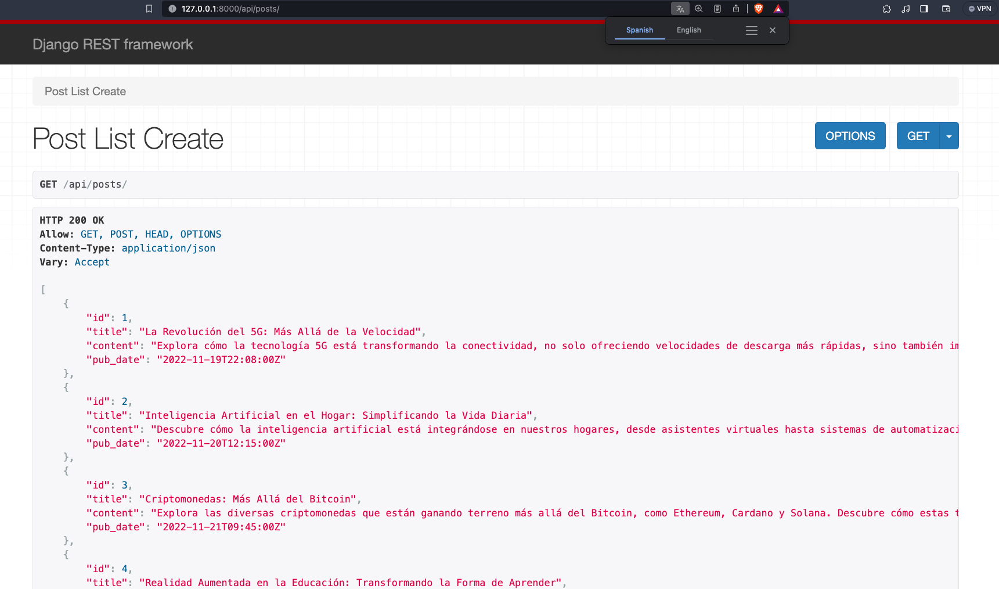
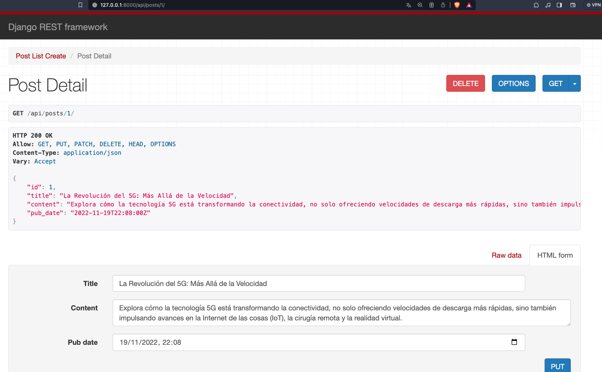
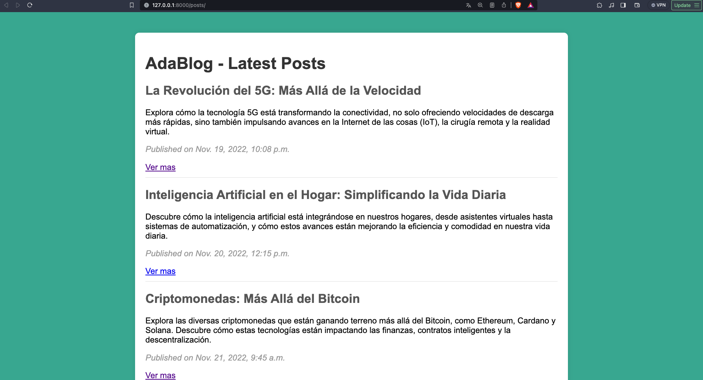
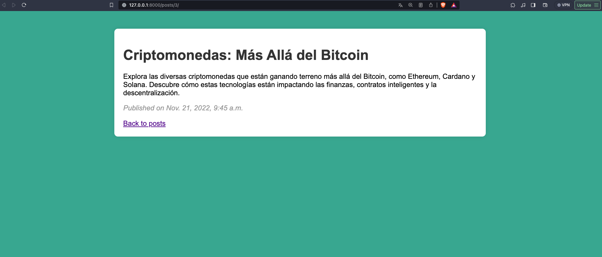
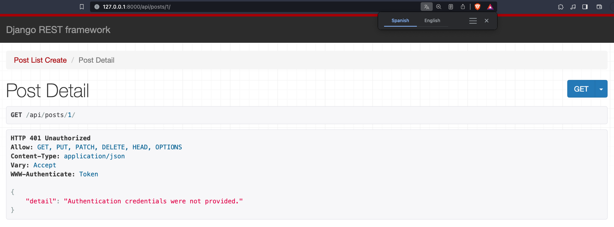
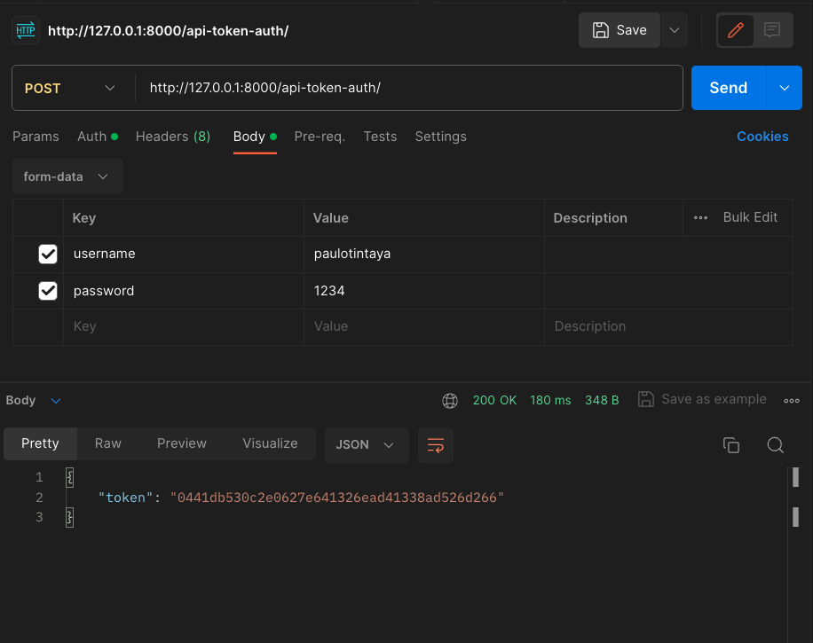
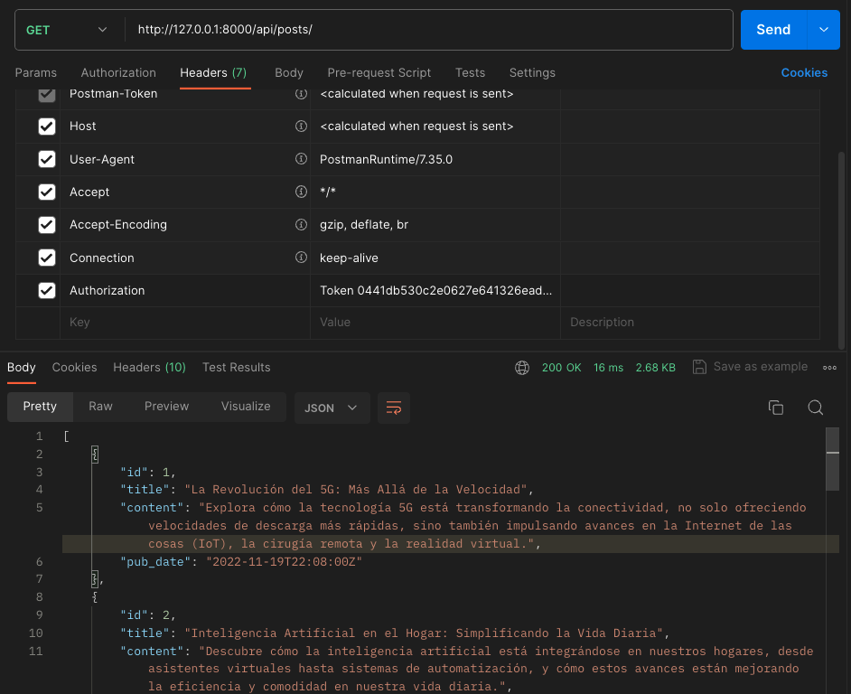

# Django Ada Blog project

Aprendemos el uso de `Django templates` y `Authentication` con Token
## Creacion de un entorno virtual

 - [Guia Windows](https://micro.recursospython.com/recursos/como-crear-un-entorno-virtual-venv.html)

    1. Abre el CMD y ubícate en la carpeta en donde quieres crear el entorno virtual
    2. Ejecuta ```python -m venv mi_entorno```
    3. Ejecuta ```mi_entorno\Scripts\activate```
    


PD:
    Por cierto, es una buena práctica usar venv o env como los nombres del entorno virtual.
    Puedes activar el entorno virtual también haciendo ```mi_entorno\Scripts\activate.bat```, es exactamente lo mismo.
## Instalacion

Instala el framework django

```python
pip install django
```
    
Instala django-rest-framework
```
  pip install djangorestframework

```

## Empezamos con el proyecto

Creamos el proyecto de nombre `tarea_project`
```
django-admin startproject adablog
```

Accedemos dentro de la carpeta del proyecto ``

```
cd adablog
```

Creamos una aplicacion dentro del proyecto
```
python manage.py startapp blog
```

Ahora dentro en la carpeta `adablog/settings.py`

debemos agregar lo siguiente en `INSTALLED_APPS` el nombre de nuestra aplicacion
```python
INSTALLED_APPS = [
    'django.contrib.admin',
    'django.contrib.auth',
    'django.contrib.contenttypes',
    'django.contrib.sessions',
    'django.contrib.messages',
    'django.contrib.staticfiles',
    'rest_framework', # añadimos drf
    'blog', #añadimos la app
]
```

## Definimos el modelo

En el archivo `blog/models.py`

```python
from django.db import models
from django.utils import timezone

class Post(models.Model):
    title = models.CharField(max_length=200)
    content = models.TextField()
    pub_date = models.DateTimeField(default=timezone.now)

    def __str__(self):
        return self.title

```

Ahora realizamos las migraciones con los siguientes comando en consola

```
# Crea migraciones para tu modelo de estudiante para definir cómo se estructurará la base de datos
python manage.py makemigrations myapp

```
```
# Luego, aplica las migraciones para crear la tabla en la base de datos
python manage.py migrate
```
Ahora si observa la base de datos `db.sqlite3` ya se encuentran creadas las tablas


## Serializando

Asi que creamos el archivo `blog/serializers.py`:
```python
from rest_framework import serializers
from .models import Post

class PostSerializer(serializers.ModelSerializer):
    class Meta:
        model = Post
        fields = ['id', 'title', 'content', 'pub_date'] # ['__all__']

```


## Vista basada en clase para la API

En el archivo `blog/views.py`

```python
# blog/views.py
from rest_framework import generics
from .models import Post
from .serializers import PostSerializer

class PostListCreateView(generics.ListCreateAPIView):
    queryset = Post.objects.all()
    serializer_class = PostSerializer


class PostDetailView(generics.RetrieveUpdateDestroyAPIView):
    queryset = Post.objects.all()
    serializer_class = PostSerializer
```
El término "generic" en GenericAPIView se refiere a que esta clase proporciona una serie de comportamientos genéricos que son comunes en muchas API web, como la creación, recuperación, actualización y eliminación (CRUD) de objetos. Esta clase sirve como base para vistas que interactúan con modelos de base de datos de una manera genérica y reutilizable.

GenericAPIView no implementa directamente la lógica para operaciones CRUD, pero proporciona mixins (mezclas) que pueden ser utilizados junto con ella para añadir funcionalidades específicas. Algunos de los mixins más comunes son:

- ListAPIView: Para la recuperación de una lista de objetos.
- CreateAPIView: Para la creación de nuevos objetos.
- RetrieveAPIView: Para la recuperación de un objeto específico.
- UpdateAPIView: Para la actualización de un objeto existente.
- DestroyAPIView: Para la eliminación de un objeto.

## Configuración de las URL
Creamos el archivo `urls.py` dentro de `blog`, configura las URL para tu vista:
```python
# blog/urls.py
from django.urls import path
from .views import PostListCreateView, PostDetailView

urlpatterns = [
    path('api/posts/', PostListCreateView.as_view(), name='post-list-create'),
    path('api/posts/<int:pk>/', PostDetailView.as_view(), name='post-detail'),
]
```

y luego en el archivo `urls.py` del proyecto:
```python
# blog/urls.py
from django.contrib import admin
from django.urls import path, include

urlpatterns = [
    path('admin/', admin.site.urls),
    path('', include('blog.urls')),
]
```
## Probamos el proyecto

```
python manage.py runserver
```

Ahora, tenemos los siguientes endpoints
- http://127.0.0.1:8000/api/posts/ la vista de DRF para los posts
- http://127.0.0.1:8000/api/posts/1 la vista de DRF para el post de id 1

Crea algunos registros de Post para luego visualizarlos.





Tambien ve probando con POSTMAN `https://www.postman.com/` o la extension de VSCode
## Django Templates
Creamos la carpeta templates dentro de blog
Ahora `blog/templates` en donde crearemos nuestros templates con html


`blog/templates/base.html`
```html

<!DOCTYPE html>
<html lang="en">
<head>
    <meta charset="UTF-8">
    <meta name="viewport" content="width=device-width, initial-scale=1.0">
    <link rel="stylesheet" href="">
    <title>AdaBlog</title>
</head>
<body>
    <div class="container">
        
    </div>
</body>
</html>


```

`blog/templates/post_list.html`
```html


AdaBlog - Posts


    <h1>AdaBlog - Latest Posts</h1>
    
        <div class="post">
            <h2>{{ post.title }}</h2>
            <p>{{ post.content }}</p>
            <p class="date">Published on {{ post.pub_date }}</p>
            <a href="">Read more</a>
        </div>
    

```

`blog/templates/post_detail.html`
```html


AdaBlog - {{ post.title }}


    <h1>{{ post.title }}</h1>
    <p>{{ post.content }}</p>
    <p class="date">Published on {{ post.pub_date }}</p>
    <a href="">Back to posts</a>

```
Ahora para los estilos e imagenes como iconos creamos la carpeta static dentro de blog
`blog/static/blog/style.css`
```css
body {
    font-family: Arial, sans-serif;
    margin: 20px;
    padding: 20px;
    background-color: #f4f4f4;
}

.container {
    max-width: 800px;
    margin: 0 auto;
    background-color: #fff;
    padding: 20px;
    border-radius: 8px;
    box-shadow: 0 0 10px rgba(0, 0, 0, 0.1);
}

h1 {
    color: #333;
}

.post {
    margin-bottom: 20px;
    border-bottom: 1px solid #ddd;
    padding-bottom: 10px;
}

h2 {
    color: #555;
}

p.date {
    color: #999;
    font-style: italic;
}
```


Quedando asi nuestro arbol de archivos
```
adablog/
│
├── blog/
│   ├── migrations/
│   ├── static/
│   │   └── blog/
│   │       └── style.css
│   ├── templates/
│   │   ├── base.html
│   │   └── post_list.html
|   │   └── post_detail.html
│   ├── __init__.py
│   ├── admin.py
│   ├── apps.py
│   ├── models.py
│   ├── tests.py
│   └── views.py
│
├── adablog/
│   ├── __init__.py
│   ├── asgi.py
│   ├── settings.py
│   ├── urls.py
│   └── wsgi.py
│
└── manage.py
```

Ahora agregamos creamos los endpoints para estos templates. Asi que actualizamos el archivo `blog/views.py` quedando ahora asi

```python
from rest_framework import generics
from .models import Post
from .serializers import PostSerializer
from django.shortcuts import render, get_object_or_404

class PostListCreateView(generics.ListCreateAPIView):
    queryset = Post.objects.all()
    serializer_class = PostSerializer


class PostDetailView(generics.RetrieveUpdateDestroyAPIView):
    queryset = Post.objects.all()
    serializer_class = PostSerializer

def post_list(request):
    posts = Post.objects.all()
    return render(request, 'post_list.html', {'posts': posts})

def post_detail(request, pk):
    post = get_object_or_404(Post, pk=pk)
    return render(request, 'post_detail.html', {'post': post})
```

Creamos las funciones `post_list` y `post_detail` que quedaran como endpoints que devolveran un archivo html gracias `render`

Ahora pasamos a los `blog/urls.py`

```python
from django.urls import path
from .views import PostListCreateView, PostDetailView, post_list, post_detail

urlpatterns = [
    path('api/posts/', PostListCreateView.as_view(), name='post-list-create'),
    path('api/posts/<int:pk>/', PostDetailView.as_view(), name='post-detail'),
    path('posts/', post_list, name='post-list'),
    path('posts/<int:pk>/', post_detail, name='post-detail-template'),
]
```
- http://127.0.0.1:8000/posts


- http://127.0.0.1:8000/posts/3


## Autenticacion basada en token
 
Proceso de verificar la identidad mediante la comprobación de un token. 
Un `token` es un elemento simbólico que expide una fuente de confianza. Pensemos en cómo los policías llevan consigo una insignia expedida por las autoridades que legitima su autoridad. Las fichas pueden ser físicas (como una llave USB) o digitales (un mensaje generado por ordenador o una firma digital)

Empezamos añadiendo a `adablog/settings.py`

en `INSTALLED_APPS`

```python
INSTALLED_APPS = [
    # previo codigo...,
    'rest_framework',
    'blog',
    'rest_framework.authtoken' #agregamos esta linea
]
```
y al final del archivo `settings.py`

```python
REST_FRAMEWORK = {
    'DEFAULT_AUTHENTICATION_CLASSES': [
        'rest_framework.authentication.TokenAuthentication',
    ],
}

```
Actualizamos las vistas de DRF creadas con generics, en `blog/views.py`
```python
from rest_framework import generics, permissions # ahroa importamos permissions
from .models import Post
from .serializers import PostSerializer
from django.shortcuts import render, get_object_or_404

class PostListCreateView(generics.ListCreateAPIView):
    queryset = Post.objects.all()
    serializer_class = PostSerializer
    permission_classes = [permissions.IsAuthenticated]  # Requiere autenticación


class PostDetailView(generics.RetrieveUpdateDestroyAPIView):
    queryset = Post.objects.all()
    serializer_class = PostSerializer
    permission_classes = [permissions.IsAuthenticated]  # Requiere autenticación

def post_list(request):
    posts = Post.objects.all()
    return render(request, 'post_list.html', {'posts': posts})

def post_detail(request, pk):
    post = get_object_or_404(Post, pk=pk)
    return render(request, 'post_detail.html', {'post': post})
```

no olvidemos actualizar `blog/views.py`

```python
from django.urls import path
from rest_framework.authtoken.views import obtain_auth_token
from .views import PostListCreateView, PostDetailView, post_list, post_detail

urlpatterns = [
    path('api-token-auth/', obtain_auth_token, name='api_token_auth'),  # Para obtener tokens
    path('api/posts/', PostListCreateView.as_view(), name='post-list-create'),
    path('api/posts/<int:pk>/', PostDetailView.as_view(), name='post-detail'),
    path('posts/', post_list, name='post-list'),
    path('posts/<int:pk>/', post_detail, name='post-detail-template'),
]
```
Creamos un endpoint `api-token-auth` para que un usuario pueda obtener su respectivo `token` mediante un metodo POST. Y asi poder acceder a las vistas como:
- http://127.0.0.1:8000/api/posts
- http://127.0.0.1:8000/api/posts/1




Para poder acceder a alguna es necesaria obtener el token del usuario en http://127.0.0.1:8000/api-token-auth mediante postman con el metodo POST y agregando en el body el `username` y `password`



Y ya con el token generado del usuario podemos hacer el GET al endpoint http://127.0.0.1:8000/api/posts pasando el token en el campo de `Authorization: tu Token` de la siguiente manera




## Reto 
- Añade dos campos mas al Modelo Post(una imagen url y autor del post)
- realiza un nuevo endpoint para mostrar los posts realizados por un autor en especifico
- realiza un nuevo endpoint para un django template(html) que muestre solamente la imagen y el titulo de todos los posts, como una galeria de imagenes